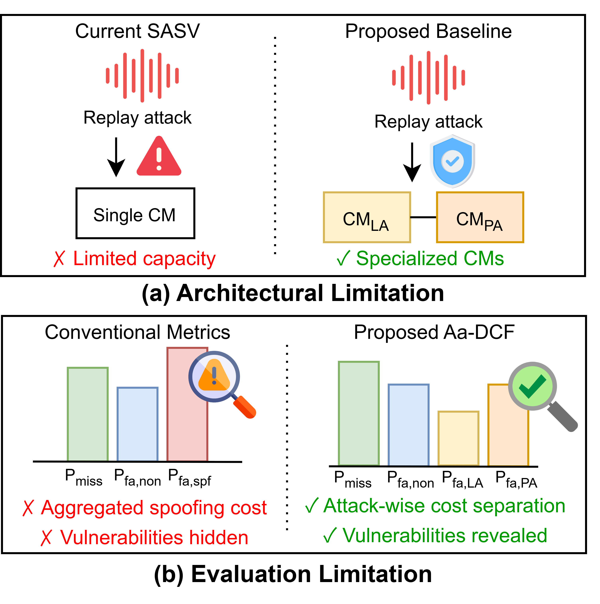

# Know Your Enemy, Know Yourself  
### Rethinking SASV under Realistic Multi-Attack Scenarios

> Dual-CM SASV architecture + Attack-aware Detection Cost Function (Aa-DCF)

---

## 📌 Overview

Recent Spoofing-Aware Speaker Verification (SASV) research has been largely **LA-centric (Logical Access)**, overlooking vulnerabilities under **PA (Physical Access, replay)** attacks.

This repository accompanies our work:

> **“Know Your Enemy, Know Yourself: Rethinking SASV under Realistic Multi-Attack Scenarios”**  
> (Interspeech 2026 submission)

We identify two fundamental limitations in current SASV systems:

1. **Architectural limitation**: A single unified CM struggles to model heterogeneous attack types (LA + PA).
2. **Metric limitation**: Conventional DCF-based metrics aggregate spoofing attacks into a single class, masking attack-specific vulnerabilities.

---

## 🔍 Problem Illustration

<p align="center">
  
</p>

### (Top) Architecture Limitation
- ❌ Single CM → Limited capacity for heterogeneous attacks  
- ✅ Dual-CM → Specialized LA CM + PA CM  

### (Bottom) Evaluation Limitation
- ❌ Conventional metrics → Aggregated spoofing cost  
- ✅ Proposed Aa-DCF → Attack-wise cost separation  

---

# 🧠 Proposed Framework

## 1️⃣ Dual-CM SASV Architecture

We propose three fusion strategies:

- Cascading  
- Score Fusion  
- DNN Fusion  

Each system uses:
- LA-specialized CM
- PA-specialized CM
- ASV

---

## 2️⃣ Attack-aware Detection Cost Function (Aa-DCF)

### 🔢 Cost & Prior Configurations

| Setting   | π_tar | π_non | π_LA | π_PA | C_miss | C_fa,non | C_fa,LA | C_fa,PA |
|------------|--------|--------|--------|--------|----------|------------|------------|------------|
| Aa-DCF1 | 0.97 | 0.01 | 0.01 | 0.01 | 1 | 10 | 10 | 10 |
| Aa-DCF2 | 0.93 | 0.01 | 0.05 | 0.01 | 1 | 10 | 10 | 10 |
| Aa-DCF3 | 0.93 | 0.01 | 0.01 | 0.05 | 1 | 10 | 10 | 10 |

### 📌 Scenario Interpretation

- **Aa-DCF1** → Balanced attack environment  
- **Aa-DCF2** → LA-dominant deployment  
- **Aa-DCF3** → PA-dominant deployment  

---

Aa-DCF formulation:

```
Aa-DCF(t) =
C_miss * π_tar * P_miss(t)
+ C_fa,non * π_non * P_fa,non(t)
+ C_fa,LA * π_LA * P_fa,LA(t)
+ C_fa,PA * π_PA * P_fa,PA(t)
```


---

# 📂 Repository Structure

```
.
├── models/
│   ├── CM/
│   ├── ASV/
│   ├── SASV/
├── scores/
├── protocol/
│   └── protocol.txt
├── notebooks/
│   └── experiment.ipynb
├── assets/
│   └── overview.png
└── README.md
```

---

# 🧩 Models Used

## 🔹 Countermeasure (CM)

### LA-trained AASIST
https://github.com/clovaai/aasist.git

### PA-trained AASIST  

Pretrained models:
https://drive.google.com/drive/folders/1NIOs21SOxLSFuO5gvVN7twWDghh357fS
### LA+PA-trained AASIST  

Pretrained models:
https://drive.google.com/drive/folders/1NIOs21SOxLSFuO5gvVN7twWDghh357fS

---

## 🔹 ASV Models

### ECAPA-TDNN
https://github.com/TaoRuijie/ECAPA-TDNN.git

### ResNet34
https://github.com/eurecom-asp/sasv-joint-optimisation.git

---

## 🔹 SASV Baselines

### MFA-Conformer  
### SKA-TDNN  
https://github.com/sasv-challenge/SASV2_Baseline.git

---

## 🔹 Proposed SASV

### Dual-CM DNN Fusion

Pretrained weights:  
https://drive.google.com/drive/folders/1NIOs21SOxLSFuO5gvVN7twWDghh357fS


### Dual-CM Score Fusion & Dual-CM Cascading

Score Fusion does **not require additional fusion training**.  
Simply use:

- LA-trained CM (AASIST)
- PA-trained CM (AASIST)
- ASV backbone (ECAPA-TDNN or ResNet34)

---

# 📊 Evaluation

Dataset:
- ASVspoof 2019 LA + PA combined evaluation set
- The corresponding trial protocol files (including target, nontarget, LA spoof, and PA spoof labels) are provided in:

```
protocols/protocol.txt
```

---

# 🧮 Computing Aa-DCF

Notebook:
```
notebooks/experiment.ipynb
```
